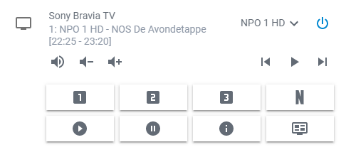
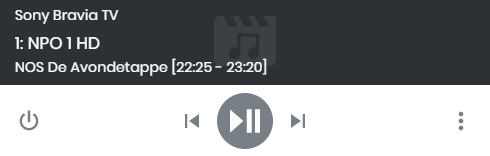

[](https://github.com/ambv/black)

[](#)
[](#)
[](https://github.com/custom-components/hacs)
[](https://community.home-assistant.io/t/sony-bravia-tv-component-with-pre-shared-key/30698?u=gerard33)

## Custom component for Sony Bravia TV using Pre-Shared Key (PSK)
A platform which allows you to interact with the Sony Bravia TV using a Pre-Shared Key.

### Homekit TV supported
The media player will show up as Television accessories on devices running iOS 12.2 or later

### Screenshots
_Component used with Mini Media Player_



_Component used with standard Media Player_



### Installation
You can use HACS or install the component manually:

To get started put the files from `/custom_components/braviatv_psk/` in your folder `<config directory>/custom_components/braviatv_psk/`

### Configuration
#### Example configuration.yaml

```yaml
media_player:
  - platform: braviatv_psk
    host: 192.168.1.101
    psk: sony
    mac: AA:BB:CC:DD:EE:FF
    amp: True
    android: True
    sourcefilter:
      - ' HD'
      - HDMI
    time_format: 12H
    user_labels: True
    name: MyBraviaTV
```

### Configuration variables

key | required | value | description  
:--- | :--- | :--- | :---
**platform** | yes | `braviatv_psk` | The platform name `braviatv_psk`.
**host** | yes | `192.168.1.101` | The IP of the Sony Bravia TV, eg. 192.168.1.101.
**psk** | yes | `sony` | The Pre-Shared Key of the Sony Bravia TV, eg. sony (see below for instructions how to configure this on the TV). Place the psk between quotes if you use digits and those start with one or more zero's, e.g. '0044'.
**mac** | no | `AA:BB:CC:DD:EE:FF` | The MAC address of the Sony Bravia TV (see below for instructions how to get this from the TV). This is used to turn on the TV using WakeOn LAN and is only needed if the TV is non-Android.
**amp** | no | `False` | Boolean, defaults to False. Set this to True if you have an amplifier attached to the TV and not use the internal TV speakers. Then the volume slider will not be shown as this doesn’t work for the amplifier. Mute and volume up and down buttons are there and working with an amplifier.
**android** | no | `False` |"Boolean, defaults to False. Set this to True when you have an Android TV as these TV’s don’t respond to WakeOn LAN commands, so another method of turning on the TV can be used. Also a service to open apps is added to Home Assistant.
**sourcefilter** | no | `HD` | List of text that is used to filter the source list, eg. ’ HD’ (with quotes) will only show TV channels in the source list which contain ‘HD’, eg. ‘NPO 3 HD’ (in my config this will only show HD channels).
**time_format** | no | `24H` | Time format to use for program information. Valid options are `12H` or `24H`, default is `24H`.
**user_labels** | no | `True` | Use the user defined labels from the TV (where configured), instead of default port labels. If you have given e.g. the HDMI2 port on your TV a label, that will be shown.
**name** | no | `Sony Bravia TV` | The name the TV will have in Home Assistant, default is `Sony Bravia TV`.

### Installation instructions TV
1. Enable remote start on your TV: [Settings] => [Network] => [Home Network Setup] => [Remote Start] => [On]
2. Enable pre-shared key on your TV: [Settings] => [Network] => [Home Network Setup] => [IP Control] => [Authentication] => [Normal and Pre-Shared Key]
3. Set pre-shared key on your TV: [Settings] => [Network] => [Home Network Setup] => [IP Control] => [Pre-Shared Key] => sony
4. Give your TV a static IP address, or make a DHCP reservation for a specific IP address in your router
5. Determine the MAC address of your TV: [Settings] => [Network] => [Network Setup] => [View Network Status]

### Services
The following service is added to Home Assistant
* braviatv_psk.bravia_command

This service can be used to send commands to your TV, like `Return` or `Up`. Useful for creating a virtual remote
control for example. A complete list with examples can be found below.

When you have an Android TV and have set `Android: True` in the configuration also the following service is added
* braviatv_psk.bravia_open_app

This service can be used to open an app on your Android TV, like `Kodi` or `Youtube`. You have to send the corresponding uri to open the app. A list with some example uris can be found below.

#### braviatv_psk.bravia_command
The use of `command_id` depends on which one are supported by your TV. Some examples are:
```
Num1
Num2
Num3
Num4
Num5
Num6
Num7
Num8
Num9
Num0
Num11
Num12
Enter
GGuide
ChannelUp
ChannelDown
VolumeUp
VolumeDown
Mute
TvPower
Audio
MediaAudioTrack
Tv
Input
TvInput
TvAntennaCable
WakeUp
PowerOff
Sleep
Right
Left
SleepTimer
Analog2
TvAnalog
Display
Jump
PicOff
PictureOff
Teletext
Video1
Video2
AnalogRgb1
Home
Exit
PictureMode
Confirm
Up
Down
ClosedCaption
Component1
Component2
Wide
EPG
PAP
TenKey
BSCS
Ddata
Stop
Pause
Play
Rewind
Forward
DOT
Rec
Return
Blue
Red
Green
Yellow
SubTitle
CS
BS
Digital
Options
Media
Prev
Next
DpadCenter
CursorUp
CursorDown
CursorLeft
CursorRight
ShopRemoteControlForcedDynamic
FlashPlus
FlashMinus
DemoMode
Analog
Mode3D
DigitalToggle
DemoSurround
AD
AudioMixUp
AudioMixDown
PhotoFrame
Tv_Radio
SyncMenu
Hdmi1
Hdmi2
Hdmi3
Hdmi4
TopMenu
PopUpMenu
OneTouchTimeRec
OneTouchView
DUX
FootballMode
iManual
Netflix
Assists
FeaturedApp
FeaturedAppVOD
GooglePlay
ActionMenu
Help
TvSatellite
WirelessSubwoofer
AndroidMenu
```

#### braviatv_psk.bravia_open_app
If you have an Android TV you can use an uri to open the corresponding app.

You can use the following command to get all uri's from the TV:
```
curl -H 'Content-Type: application/json' -H 'X-Auth-PSK:[psk]' -X POST -d "{'id': 1, 'method': 'getApplicationList', 'version': '1.0', 'params': ['']}" http://[IP]/sony/appControl
```
Change `[psk]` with your psk and `[IP]` with the IP address of the TV.

Also see [this](https://community.home-assistant.io/t/sony-bravia-tv-component-with-pre-shared-key/30698/164) post to get a list of all apps supported by your TV.
Some examples:
```
YouTube uri: "com.sony.dtv.com.google.android.youtube.tv.com.google.android.apps.youtube.tv.activity.ShellActivity"
Music uri: "com.sony.dtv.com.sony.dtv.osat.music.com.sonyericsson.music.MusicActivity"
Netflix uri: "com.sony.dtv.com.netflix.ninja.com.netflix.ninja.MainActivity"
Kodi uri: "com.sony.dtv.org.xbmc.kodi.org.xbmc.kodi.Splash"
```
Working uri's for Sony KD-55XF9005:
[KD-55XF9005.txt](https://github.com/custom-components/media_player.braviatv_psk/files/4754110/KD-55XF9005.txt)

Working uri's for Sony KD-50W805C:
[KD-50W805C.txt](https://github.com/custom-components/media_player.braviatv_psk/files/4754111/KD-50W805C.txt)
